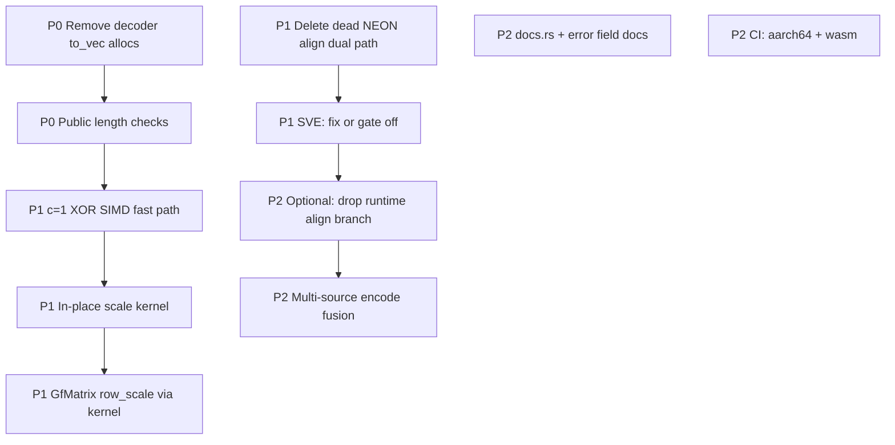

# Multi-Panel Expert Review — `rlnc-simdx` SIMD RLNC Crate

**Reviewers (simulated panel):**
Intel ISA/GFNI microarchitecture · AMD Zen SIMD · ARM NEON/SVE · Rust core / crates.io API · HPC network coding

**Scope:** field tables, kernel hierarchy, alignment strategy, encoder/decoder/recoder, benches, public API.
**Evidence:** source as of 2026-07-23 + standalone bench on host (`gfni+avx512` tier1).

## Status note

Many **P0/P1** items from this review (decoder allocs, `c==1`, NEON dual-path removal,
SVE gate, `scale_inplace`, property tests) and subsequent **security** items are done.
Architecture and public API docs: [`architecture.md`](architecture.md), [`README.md`](../README.md).
This file remains the historical performance/ISA review; prefer CHANGELOG + architecture for current truth.

---

## Executive Verdict

| Dimension | Grade | Notes |
|-----------|-------|-------|
| Field correctness (AES poly / GFNI) | **A** | 0x11B + g=0x03 is the right choice for `GF2P8MULB` |
| Kernel hierarchy design | **A−** | 9-tier table is industry-correct; SVE incomplete |
| Runtime dispatch | **A−** | `OnceLock` + feature detect is the right Rust pattern |
| Aligned-by-default data path | **B+** | Right product decision; kernel branch may be over-engineered |
| Hot-path decode performance | **D** | **Allocations inside GE loop kill SIMD gains** |
| API readiness for crates.io | **B** | Solid skeleton; safety contracts & docs incomplete |
| ARM / WASM maturity | **C+** | NEON OK; SVE stub/wrong; WASM stubs on host only |
| Bench / portability | **A** | GB/s standalone binary is excellent for multi-machine review |

**Ship gate:** fix decoder hot-path allocations before any “world-class performance” claim on decode. Encode kernel path is already competitive.

---

## 1. What the panel endorses (do not regress)

### 1.1 Field (all panels)

- Polynomial **0x11B**, generator **0x03** matches AES / Intel GFNI — zero conversion on hardware mul.
- Doubled `EXP[512]` avoids `% 255` in the hot path — correct classic technique.
- Const-generated tables in `.rodata` — correct for `no_std`.

### 1.2 Kernel math (Intel / AMD / ARM)

- **GFNI path:** `y ^= GF2P8MULB(x, c_broadcast)` is the optimal AXPY form.
- **Nibble-split + pshufb / vqtbl1q / i8x16.swizzle:** standard portable GF(2⁸)×const technique; `make_nibble_tables` + exhaustive test is the right golden model.
- **4-way unroll on 512-bit GFNI** (256 B per iteration) matches Ice Lake / Zen4 L1 dual-load bandwidth thinking.

### 1.3 Dispatch (Rust)

- Compile all tiers, pick at runtime via `is_x86_feature_detected!` — correct for a **library** binary (unlike app-only `-C target-cpu=native`).
- Function pointers in `OnceLock` — one atomic load after init; acceptable.

### 1.4 Alignment product decision

- Internal `AlignedBuffer` + 64 B row stride padding means GE/encode always feed aligned pointers — correct for a “best performance by default” crate.
- Unaligned fallback remaining for external `&[u8]` — correct API hygiene.

### 1.5 Measurement

- Standalone GB/s binary + Criterion with `Throughput::Bytes` — correct dual track for lab vs laptop.

---

## 2. Critical findings (must fix)

### P0 — Decoder allocates on every GE step (Rust + HPC)

[`decoder.rs`](rlnc-simdx/src/decoder.rs) forward elimination:

```rust
let pivot_slice: Vec<u8> = self.rows[r].as_slice().to_vec(); // ALLOC every r
kernel::axpy(coeff, &pivot_slice, row.as_mut_slice());
```

And normalize:

```rust
let src = AlignedBuffer::from_slice(row.as_slice()); // ALLOC + copy
kernel::scale(inv, src.as_slice(), row.as_mut_slice());
```

**Impact:** For each innovative packet you pay `O(rank)` heap allocs + memcpy. At `k=32`, `n=64KiB`, this dominates the GFNI AXPY. SIMD becomes irrelevant.

**Why it exists:** Rust borrow checker — cannot hold `&rows[r]` and `&mut row` if `row` might alias (it doesn’t once row is a separate buffer).

**Fix options (panel consensus):**

1. **Preferred:** keep incoming row as `AlignedBuffer` separate from `self.rows` (already true) and use **raw pointers** or `split` only on `self.rows` for *existing* pivots:
   ```rust
   // pivot is &self.rows[r], dst is &mut row  — disjoint ownership, no alloc
   kernel::axpy(coeff, self.rows[r].as_slice(), row.as_mut_slice());
   ```
   This is **already legal**: `row` is a local `AlignedBuffer`, `self.rows[r]` is a different allocation. **No `to_vec` needed.**

2. For in-place scale: `kernel::scale(inv, …)` needs distinct src/dst **or** an in-place scale kernel:
   ```rust
   // Option A: scale in place (add scale_inplace kernel)
   // Option B: axpy-style: copy once to tmp only if inv != 1, or
   //           use scale with same buffer only if kernel supports in-place
   ```
   **Intel/Rust joint note:** GFNI scale is pure map `y[i]=c*x[i]`; if `x` and `y` are the same pointer, unaligned load then store per vector is **safe for non-overlapping vector chunks** if you process sequentially with no read-after-write within a chunk (load full zmm, mul, store same zmm) — **in-place is fine**.

**Action:** delete both allocations; use direct slice refs + in-place `scale`/`axpy` contract documented as “src and dst may alias iff identical ranges and width divides VL”.

---

### P0 — Kernel length mismatch only `debug_assert` (Rust safety)

All SIMD kernels:

```rust
debug_assert_eq!(x.len(), y.len());
```

In **release**, mismatched lengths → out-of-bounds SIMD store → **UB / silent memory corruption**.

**Action:**

```rust
assert_eq!(x.len(), y.len()); // or early return / Result at public API
// Public axpy/scale must enforce; internal unsafe may debug_assert only if
// every caller is proven equal-length (document as safety invariant).
```

Panel split: public `kernel::axpy` should **always** check; `unsafe` tier functions may assume after `debug_assert` **if** and only if crate-private.

---

### P1 — Alignment branch may hurt more than help (Intel µarch)

On **Skylake / Ice Lake / Sapphire Rapids / Zen4**:

- Aligned `VMOVDQA64` vs unaligned `VMOVDQU64` when data **is** aligned: **same throughput**.
- Cost of `both_aligned64` branch + **doubled code size** (I-cache, uop cache) is real for mid sizes.
- Mispredict when mixing aligned internal + unaligned external buffers hurts tail latency.

**Intel recommendation:**

1. Prefer **always `_loadu` / `_storeu`** for general kernels (current best practice in glibc, OpenSSL, etc. on modern x86).
2. Keep **alignment of data structures** (what you did with `AlignedBuffer`) — that is the 95% win.
3. Optional: `#[cfg(target_feature)]` or separate `axpy_aligned` only for expert / internal GE path with monomorphic call sites (no runtime branch).
4. Future: non-temporal stores (`_mm512_stream_si512`) **require** alignment and non-temporal etiquette (fence) — only for ≥L3 streaming writes.

**AMD note:** Zen4 similarly; no need for dual paths for performance.

**ARM note:** AArch64 `ld1` is alignment-agnostic for performance on modern cores; dual NEON paths with identical `vld1q_u8` are pure dead code — delete.

---

### P1 — Missing `c == 1` fast path in SIMD (all ISA)

Scalar:

```rust
if c == 1 { /* pure XOR */ }
```

GFNI / SSSE3 kernels always do full multiply. Systematic encode and many GE steps use `c = 1`.

**Action:** at top of every `axpy`:

```rust
if c == 1 {
    // SIMD XOR-only loop (or dispatch to xor_kernel)
}
```

Expected: free ~2–4× on those calls; large win for systematic + identity rows.

---

### P1 — SVE module is not production-ready (ARM)

Issues in [`sve.rs`](rlnc-simdx/src/kernel/arm/sve.rs):

1. **Not wired** into runtime dispatch (always NEON on AArch64).
2. `svtbl_u8` only indexes into the **table vector’s VL**, not a 256-byte logical table. Building `full_lo[256]` and `svld1` with `svwhilelt(0,256)` is **invalid** when VL=16/32/64 — wrong results or out-of-range predicates.
3. Correct SVE nibble approach: keep **16-byte** lo/hi tables in Z regs (or 2× `svtbl` on 16-entry), same as NEON, with predicates for the tail — **not** 256-entry full map unless VL≥256 and multi-vector table gather.

**Action:** mark SVE experimental or rewrite + add to dispatch when `is_aarch64_feature_detected!("sve")` (nightly/stable feature gate as required).

---

### P1 — GfMatrix `row_scale` bypasses SIMD (HPC)

[`matrix.rs`](rlnc-simdx/src/matrix.rs) `row_scale` uses scalar log/exp loop instead of `kernel::scale`. GE normalize path should use SIMD.

---

### P2 — AVX-512 / AVX2 transition (Intel)

- `gfni_avx512` uses 256-bit GFNI tail **without** `_mm256_zeroupper()` before returning to scalar SSE-ish code — less critical if entire hot path is EVEX, but hybrid P/E cores and older transition manuals still recommend zeroupper after YMM use outside pure AVX-512 functions.
- Prefer stay in ZMM until final scalar tail only.

---

### P2 — No multi-source fused encode kernel (all)

Encode does:

```text
for i in 0..k: axpy(c_i, source[i], payload)
```

**k independent streams** → k full passes over payload. Better:

- Register-block: process 64 B of payload, accumulate k terms in registers (k small), or
- For k≤8, keep 8 coefficient vectors live and stream sources.

Expected encode thr. uplift 1.5–3× at large `n` (DRAM).

---

### P2 — API / crates.io (Rust)

| Issue | Recommendation |
|-------|----------------|
| `CodedPacket` owns `AlignedBuffer` | Good for perf; also expose `payload.as_slice()` + `into_vec()` / `from_vec()` for FFI |
| No length check on public axpy | Always check |
| `missing_docs` on error fields | Fix for docs.rs |
| Overlapping `x`/`y` | Document: must not partially overlap; full alias OK only for in-place scale |
| Feature `runtime-dispatch` (historical) | Later removed as a no-op; `std` controls runtime dispatch |
| MSRV | State clearly (e.g. 1.75+) |
| `unsafe` surface | Keep kernels `pub` only under `kernel::x86` for advanced users; default path safe |

---

### P2 — WASM (portability)

- Host builds only stubs; OK.
- `v128_load` on possibly unaligned WASM pointers: WASM SIMD allows unaligned; OK.
- Need CI job: `wasm32-unknown-unknown` + `wasm-pack` / wasmer tests.

---

## 3. Microarchitecture scorecard (kernels)

| Kernel | Correctness | Peak thr. design | Code quality | Notes |
|--------|-------------|------------------|--------------|-------|
| gfni_avx512 | A | A | B+ | Dual align path optional; add c=1; zeroupper policy |
| gfni_avx2 | A | A | B+ | Good macro for load/store |
| gfni_sse | A | A | B | |
| avx512_ssse3 | A | B+ | B | Rebuild nibble tables every call — unavoidable for varying c |
| avx2_ssse3 | A | B+ | B | zeroupper present — good |
| ssse3 | A | B | B | |
| neon | A | B | C | Delete duplicate align branches |
| sve | **F** | — | D | Do not ship as-is |
| wasm | B | B | B | Untested in CI |
| scalar | A | C | A | Reference model |

---

## 4. Performance narrative (host evidence)

From standalone `--quick` (aligned buffers, SI GB/s on payload size):

| Size | Scalar AXPY | Best SIMD | Speedup |
|------|-------------|-----------|---------|
| 1 KiB | ~1 GB/s | ~94 GB/s | ~96× |
| 16 KiB | ~1.5 GB/s | ~117 GB/s | ~76× |
| 64 KiB | ~1.5 GB/s | ~47 GB/s | ~31× |
| 1 MiB | ~1.5 GB/s | ~22 GB/s | ~15× |

**Interpretation (Intel/AMD joint):**

- ≤L2: compute-bound GFNI wins spectacularly — design validated.
- ≥DRAM: approaches ~⅓ of dual-channel bandwidth (AXPY ≈ 2R+1W) — expected; further gains need NT stores / better encode fusion, not more VL.

**Decode:** do **not** quote these numbers for decode until P0 allocs are gone.

---

## 5. Recommended work queue (priority order)



---

## 6. Design decisions the panel reaffirms

1. **AES field for GFNI** — non-negotiable for Intel/AMD hardware mul.
2. **Runtime multi-versioning** for a library — correct.
3. **Aligned internal storage by default** — correct product goal; keep.
4. **Portable standalone GB/s binary** — keep as first-class deliverable.
5. **Nibble-split for non-GFNI** — correct; do not invent CLMUL-only unless benchmarking shows win on specific ARM.

---

## 7. What “world-class official crate” still needs

- [ ] P0 decode path clean (no alloc in GE)
- [ ] Property tests / proptest against bit-exact scalar for random c, lengths, alignments
- [ ] Cross-ISA CI (x86_64, aarch64, wasm32)
- [ ] Documented safety & aliasing contract
- [ ] Changelog + semver policy for `AlignedBuffer` in public packets
- [ ] Optional: constant-time story (RLNC usually not CT; say so explicitly)
- [ ] Optional: `rayon` parallel generations (out of scope for core)

---

## 8. One-line summary per expert

| Expert | One-liner |
|--------|-----------|
| **Intel** | GFNI kernels are right; drop dual load paths for thr.; fix decode allocs; add `c=1` XOR. |
| **AMD** | Zen4 GFNI tier OK; Zen3 needs AVX2 nibble — present; watch frequency on fat AVX-512 loops only if server SKU. |
| **ARM** | NEON nibble is fine; SVE code is wrong — fix or hide; dual align path is noise. |
| **Rust** | Safe public API is almost there; release-mode length checks mandatory; decoder borrows are a free win. |
| **HPC/NC** | Encode thr. is competitive; decode not yet — GE alloc is the smoking gun. |

---

*End of panel review. Implement P0 first, then re-bench decode end-to-end.*
